# Media Controls

  

## About this fork

This is a personal fork of [sakithb/media-controls](https://github.com/sakithb/media-controls), which was archived by its original author on 2026-04-22 and is no longer maintained upstream. All credit for the original design and implementation goes to sakithb and the project's contributors — this fork exists to keep the extension working on current GNOME Shell versions.

## What does this extension do?

Show controls and information of the currently playing media in the panel.

## Features

- Customize the extension the way you want it
- Basic media controls (play/pause/next/previous/loop/shuffle/seek)
- Mouse actions lets you run different actions via left/middle/right/scroll.
- Popup with album art and a slider to control the playback
- Scrolling animations
- Blacklist players

---

## How to install

This fork is not published on extensions.gnome.org — the [original listing](https://extensions.gnome.org/extension/4470/media-controls/) belongs to the archived upstream project and reflects its last release, not this fork. Install from source instead.

#### Manual installation

Install from source

- Download archive file from the releases tab
- Open a terminal in the directory containing the downloaded file
- Install and enable the extension by executing `gnome-extensions install extension.zip --force` in the terminal

---

## Reporting issues

- Make sure your issue isn't a duplicate
- Include the following information when creating the issue,
  - Extension version
  - Gnome version
  - Your distribution
  - A screenshot if it is possible

---

## Development

This project uses pnpm for package management and script execution. Make sure you have pnpm installed.

### Available Scripts

**Building:**

- `pnpm build` - Build the extension
- `pnpm release` - Build release version (strips debug code)

**Development:**

- `pnpm debug` - Run a nested gnome session for debugging
- `pnpm translations` - Update translation files

**Extension Management:**

- `pnpm run ext:install` - Install the extension
- `pnpm run ext:uninstall` - Uninstall the extension
- `pnpm run ext:enable` - Enable the extension
- `pnpm run ext:disable` - Disable the extension
- `pnpm run ext:prefs` - Open extension preferences

### Quick Start for Contributors

1. Clone the repository
2. Install dependencies: `pnpm install`
3. Build and install: `pnpm reinstall`
4. Enable the extension: `pnpm run enable`
5. Open preferences to test: `pnpm run prefs`

For active development, use `pnpm reload` (X11) or `pnpm debug` (Wayland) to test changes.

---

## Get involved

Any type of contribution is appreciated! If you have any suggestions for new features feel free to open a new issue.

If you are interested in translating, download the [po file](https://github.com/ScottMorris/gnome-media-controls/blob/main/assets/locale/mediacontrols%40cliffniff.github.com.pot) and translate it. Then open a pull request with the translated file. You can use [Gtranslator](https://flathub.org/apps/org.gnome.Gtranslator) or [Poedit](https://flathub.org/apps/net.poedit.Poedit) to translate.

If you are interested in contributing code. There are no specific guidelines for contributing. Just make sure you follow the coding style of the project. To update the translation files run `pnpm run translations` in the extensions directory after your changes are done. This will update the files in the locale folder.

Made with [contrib.rocks](https://contrib.rocks).

## Screenshots

#### Popup menu

#### General settings

#### Panel settings

#### Position settings

#### Shortcut settings

#### Other settings

